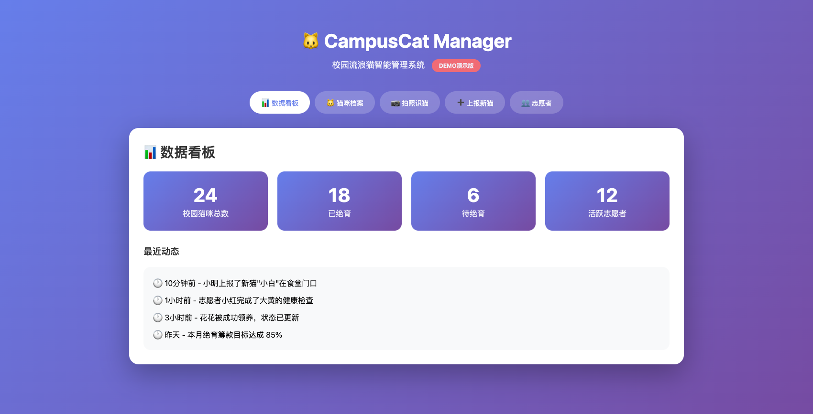

# 🐱 CampusCat Manager

[](https://opensource.org/licenses/MIT)
[](https://techforgood.qq.com)
[](https://github.com/yourusername/campuscat-manager)

> 🎓 **基于腾讯技术公益数字工具箱的校园流浪猫智能管理解决方案**
> 
> 让每个校园猫协都能高效、科学地管理流浪猫，实现数字化、透明化、智能化运营。

<p align="center">
  
</p>

---

## ✨ 核心功能

| 功能模块 | 描述 | 状态 |
|:--------:|:-----|:----:|
| 📊 **数据看板** | 猫咪数量统计、绝育情况、志愿者活跃度一目了然 | ✅ |
| 🐱 **猫咪档案** | 每只猫的完整生命周期档案，支持照片、健康记录、位置追踪 | ✅ |
| 📷 **AI拍照识猫** | 上传照片自动识别猫咪身份，解决"这是哪只猫"难题 | ✅ |
| ➕ **新猫上报** | 学生发现新猫可快速上报，建立档案 | ✅ |
| 👥 **志愿者管理** | 志愿者招募、服务时长统计、任务分配 | ✅ |
| 💰 **财务透明** | 绝育筹款、医疗费用公开可查 | 🚧 |
| 🏠 **领养对接** | 待领养猫咪展示、领养申请流程 | 🚧 |

> ✅ 已完成 | 🚧 开发中

---

## 🚀 快速开始

### 方式一：在线体验（推荐）

🌐 **Demo地址**: http://106.52.61.187/campuscat/ （部署后更新）

### 方式二：本地运行

```bash
# 克隆仓库
git clone https://github.com/yourusername/campuscat-manager.git
cd campuscat-manager

# 进入Demo目录
cd demo

# 用浏览器打开 index.html
# 或使用Python临时服务器
python -m http.server 8080
```

### 方式三：部署到腾讯云

详见 [部署指南](docs/DEPLOY.md)

---

## 🏗️ 技术架构

```
┌─────────────────────────────────────────────────────────────┐
│                      用户层（学生/志愿者）                      │
│  ┌──────────┐  ┌──────────┐  ┌──────────┐  ┌──────────┐     │
│  │  拍照识猫  │  │  上报新猫  │  │  查看档案  │  │  申请领养  │     │
│  └────┬─────┘  └────┬─────┘  └────┬─────┘  └────┬─────┘     │
└───────┼─────────────┼─────────────┼─────────────┼───────────┘
        │             │             │             │
        ▼             ▼             ▼             ▼
┌─────────────────────────────────────────────────────────────┐
│                      应用层（腾讯工具）                        │
│  ┌──────────┐  ┌──────────┐  ┌──────────┐  ┌──────────┐     │
│  │ 腾讯元器  │  │ 腾讯问卷  │  │ 腾讯文档  │  │  灵析系统  │     │
│  │ AI识猫助手│  │  新猫上报  │  │ 档案/财务  │  │志愿者/领养 │     │
│  └────┬─────┘  └────┬─────┘  └────┬─────┘  └────┬─────┘     │
└───────┼─────────────┼─────────────┼─────────────┼───────────┘
        │             │             │             │
        ▼             ▼             ▼             ▼
┌─────────────────────────────────────────────────────────────┐
│                      能力层（腾讯云AI）                        │
│  ┌──────────────────┐  ┌──────────────────┐                 │
│  │  图像识别/相似度匹配  │  │  云存储/云函数      │                 │
│  └──────────────────┘  └──────────────────┘                 │
└─────────────────────────────────────────────────────────────┘
```

---

## 🛠️ 技术栈

| 层级 | 技术/工具 | 说明 |
|:----:|:---------|:-----|
| 前端 | HTML5 + CSS3 + Vanilla JS | 零框架，轻量快速 |
| UI设计 | 响应式布局 + CSS动画 | 移动端优先 |
| AI能力 | 腾讯云视觉识别 | 图像识别、相似度匹配 |
| 后端 | 腾讯云云函数 | Serverless架构 |
| 存储 | 腾讯云COS | 照片、文档存储 |
| 协作工具 | 腾讯文档、企业微信、腾讯问卷 | 零代码运营 |

---

## 📋 项目结构

```
campuscat-manager/
├── 📁 demo/                      # 演示Demo
│   └── index.html               # 单文件完整应用
├── 📁 docs/                      # 文档
│   ├── DEPLOY.md                # 部署指南
│   ├── API.md                   # API接口文档
│   └── images/                  # 截图和示意图
├── 📁 templates/                 # 模板文件
│   ├── 猫咪档案表模板.xlsx
│   └── 发现新猫上报问卷.md
├── 📁 src/                       # 源代码（未来扩展）
│   ├── components/              # 组件
│   └── utils/                   # 工具函数
├── 📄 README.md                  # 项目说明
├── 📄 LICENSE                    # 开源协议
├── 📄 CONTRIBUTING.md            # 贡献指南
├── 📄 CHANGELOG.md               # 更新日志
└── 📄 .gitignore                 # Git忽略文件
```

---

## 🎯 使用场景

### 场景1：发现新猫
> 学生在食堂门口发现一只没见过的橘猫

1. 扫描二维码打开「发现新猫上报问卷」
2. 上传猫咪照片，填写发现地点
3. 猫协管理员收到通知，比对档案库
4. 确认是新猫 → 分配ID，建立档案

### 场景2：识别猫咪
> 学生想喂猫但不知道这只猫叫什么

1. 打开企业微信，进入「识猫助手」
2. 上传猫咪照片
3. AI识别返回：这是"大黄"，已绝育，亲人可摸，常活动在图书馆区域

### 场景3：志愿者排班
> 周末需要安排志愿者投喂

1. 在灵析系统中查看志愿者名单和空闲时间
2. 群发通知，志愿者报名接龙
3. 自动记录服务时长

---

## 🤝 如何贡献

我们欢迎所有形式的贡献！详见 [CONTRIBUTING.md](CONTRIBUTING.md)

### 贡献方式

- 🐛 **提交Bug** - 发现问题请提交Issue
- 💡 **提出建议** - 有新想法欢迎讨论
- 📝 **完善文档** - 帮助改进文档
- 🔧 **提交代码** - 修复Bug或开发新功能

### 贡献者

感谢以下贡献者（按贡献时间排序）：

<!-- ALL-CONTRIBUTORS-LIST:START - Do not remove or modify this section -->
<!-- prettier-ignore-start -->
<!-- markdownlint-disable -->

<!-- markdownlint-restore -->
<!-- prettier-ignore-end -->
<!-- ALL-CONTRIBUTORS-LIST:END -->

---

## 📜 开源协议

本项目采用 [MIT License](LICENSE) 开源协议。

```
MIT License

Copyright (c) 2025 CampusCat Manager Contributors

Permission is hereby granted, free of charge, to any person obtaining a copy
of this software and associated documentation files (the "Software"), to deal
in the Software without restriction, including without limitation the rights
to use, copy, modify, merge, publish, distribute, sublicense, and/or sell
copies of the Software, and to permit persons to whom the Software is
furnished to do so, subject to the following conditions:

The above copyright notice and this permission notice shall be included in all
copies or substantial portions of the Software.
```

---

## 🙏 致谢

- [腾讯技术公益数字工具箱](https://techforgood.qq.com) - 提供免费智能化工具支持
- [腾讯云](https://cloud.tencent.com) - 提供云计算和AI能力
- 所有关心校园流浪猫的志愿者和猫协

---

## 📞 联系我们

- 📧 邮箱：campuscat@example.com（待更新）
- 💬 讨论区：[GitHub Discussions](../../discussions)
- 🐛 问题反馈：[GitHub Issues](../../issues)

---

<p align="center">
  <strong>🐾 让每只校园猫咪都被看见、被记录、被关爱</strong>
</p>

<p align="center">
  Made with ❤️ by CampusCat Manager Team
</p>